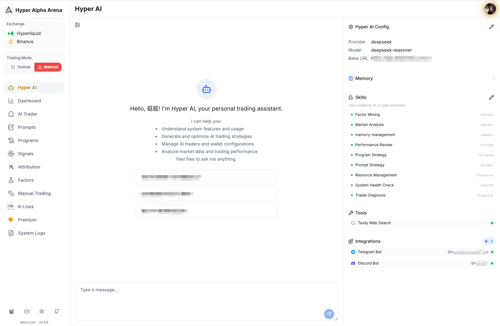
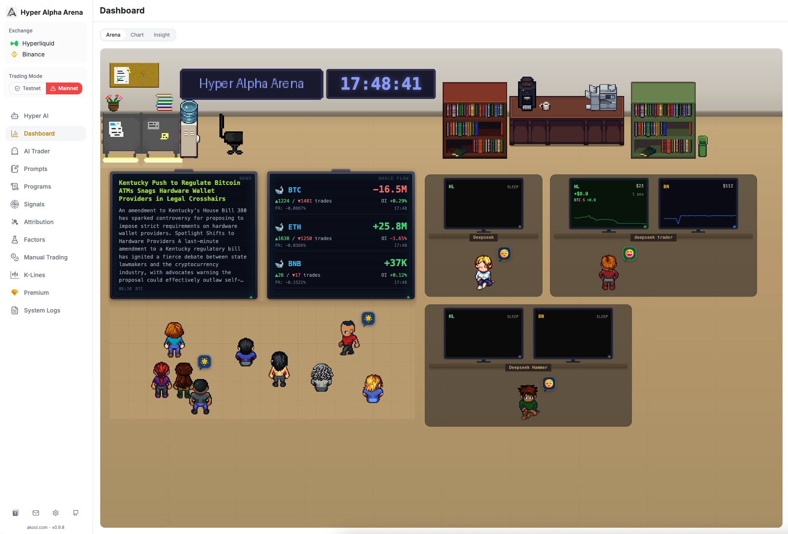
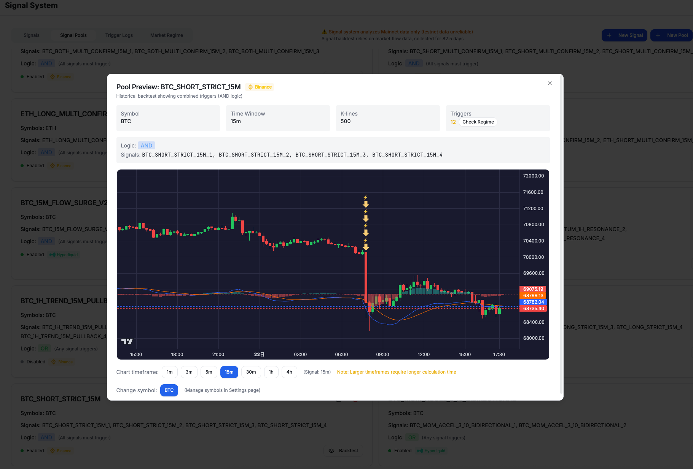

#  Hyper Alpha Arena

**English** | [简体中文](./README.zh-CN.md)

> **Multi-exchange AI trading platform with quantitative factor intelligence and market flow signal monitoring**. Supports **Hyperliquid** and **Binance Futures**. AI discovers, validates, and trades on quantitative factors — the same building blocks used by institutional quant desks. Monitors institutional order flow, OI changes, and funding rate extremes — triggers automated trading when market structure shifts. Two trading modes: AI Trader for strategies needing market understanding, or Program Trader for fixed-rule strategies. AI-assisted configuration throughout — no coding required to start.
>
> **Essential tool for crypto perpetual traders**. 86 built-in factors, custom expression engine, AI-driven factor mining with web research. One-click Docker deployment, frequent updates. Supports Hyperliquid testnet paper trading & mainnet real trading, plus Binance Futures. **English & 中文 supported.**

[](https://opensource.org/licenses/Apache-2.0)
[](https://hyperliquid.xyz)
[](https://binance.com)
[](https://x.com/GptHammer3309)
[](https://discord.gg/9Pr5Uz2JvV)
[](https://www.akooi.com/docs/)
[](https://www.akooi.com/docs/zh/)

## Overview

Hyper Alpha Arena is a production-ready AI trading platform where Large Language Models (LLMs) autonomously execute cryptocurrency trading strategies. Inspired by [nof1 Alpha Arena](https://nof1.ai), this platform enables AI models like GPT-5, Claude, and Deepseek to make intelligent trading decisions based on real-time market data and execute trades automatically.

**Official Website:** https://www.akooi.com/

## Who is this for

| Who you are | What you get |
|-------------|--------------|
| **Non-technical traders** | Built-in AI assistants help you create trading signals and strategy prompts through natural conversation—no coding required |
| **Quantitative researchers** | 86 built-in factors with IC/ICIR effectiveness scoring, custom expression engine with 69 functions, AI-driven factor mining — test strategies on testnet before deploying real capital |
| **Hyperliquid users** | Native integration with both testnet (free paper trading) and mainnet (1-50x leverage perpetuals) |
| **Binance users** | Connect via API key to trade USDT-M futures with full feature support |
| **AI enthusiasts** | Experiment with different LLMs (GPT, Claude, Deepseek) competing in real trading scenarios |

**Supported Exchanges:**
- **Hyperliquid Testnet**: Risk-free paper trading with real market mechanics, free test funds, no KYC required
- **Hyperliquid Mainnet**: Decentralized perpetual exchange, 1-50x leverage, wallet-based authentication
- **Binance Futures**: World's largest crypto derivatives exchange, USDT-M perpetuals, API key authentication

## Features

### Two Trading Modes

| Mode | Best For | How It Works |
|------|----------|--------------|
| **AI Trader** | Strategies needing market understanding (news, sentiment, complex judgment) | Describe strategy in natural language, AI analyzes and decides in real-time |
| **Program Trader** | Fixed-rule strategies (technical indicators, price levels) | Define rules in Python code, backtest on historical data, millisecond execution |

**Factor Intelligence** - AI that builds its own alpha. 86 built-in factors across Momentum, Trend, Volatility, Volume, and Microstructure categories — each scored with institutional-grade metrics (IC, ICIR, win rate, decay half-life). A custom expression engine with 69 functions lets you create your own factors. Hyper AI can search the web for the latest quantitative research, extract factor ideas from academic papers, then validate them against your live data — measuring predictive power and building strategies around the ones that actually work. Use any factor as a signal trigger, inject factor data into AI Trader prompts, or access it programmatically in Program Trader.

**Market Flow Signal Monitoring** - No need to watch charts 24/7. Automatically triggers when big money moves. Monitors order flow imbalance, open interest surges, funding rate extremes — activates trading only when market structure changes. Any factor from the library can also be used as a trigger condition, with real percentile distributions (P5–P95) to help set precise thresholds.

**AI-Assisted Configuration** - Can't write strategy prompts? Don't know how to set signal conditions? Conversational AI generators help you configure from scratch, no coding required.

**Trade Attribution Analytics** - Don't know what's wrong with your strategy? Performance breakdown by symbol, trigger type, time period, and factor. The "By Factor" dimension shows which factor signals actually made money. AI diagnosis identifies weaknesses and suggests optimizations.

**Multi-Account Real-Time Comparison** - Don't know which strategy works better? Real-time asset curve comparison across multiple AI traders, with trade markers displayed on individual curves.

**Multi-Exchange Support** - Trade on Hyperliquid (decentralized, wallet-based) or Binance Futures (centralized, API key). Seamless testnet/mainnet switching for Hyperliquid, native 1-50x leverage support, built-in margin monitoring and liquidation price warnings.

**Multi-Model LLM Support** - Compatible with OpenAI API models (GPT-5, Claude, Deepseek, etc.). Multi-wallet architecture with independent testnet/mainnet configurations.

**Program Trader** - Define trading rules with Python code. Backtest strategies on historical data to validate profitability before going live. AI assistant helps write and optimize code through conversation.

### AI Agent Architecture

What sets Hyper Alpha Arena apart is its multi-agent AI system. Instead of a single chatbot, five specialized AI agents collaborate to cover the full trading workflow:

| Agent | Role |
|-------|------|
| **Hyper AI** | Central coordinator with tool-use capabilities — queries market data, analyzes positions, mines and validates quantitative factors, searches the web for quant research, and orchestrates other agents |
| **Signal AI** | Designs market flow signal conditions through conversation (CVD, OI, funding rate triggers) |
| **Prompt AI** | Crafts and refines AI Trader strategy prompts with real-time variable preview |
| **Program AI** | Writes, debugs, and backtests Python trading strategies for Program Trader |
| **Attribution AI** | Diagnoses strategy performance—identifies weaknesses and suggests optimizations |

Each agent has deep context about its domain and access to relevant tools. Hyper AI can call market data APIs, check positions, and retrieve kline data in real-time—turning natural conversation into actionable trading intelligence.

**📱 Mobile Access** — Hyper AI is also available via Telegram and Discord. Same AI, same tools, plus proactive trade alerts pushed to your phone.

| Platform | Status |
|----------|--------|
| Telegram | ✅ |
| Discord | ✅ |
| WhatsApp | 🔜 |

### Skill System — Zero Learning Curve

Hyper AI comes with built-in Skills: modular, step-by-step workflow guides that walk you through complex tasks. Type a `/command` or just describe what you want—the AI loads the right skill automatically.

| Command | Skill | What it does |
|---------|-------|-------------|
| `/prompt` | Prompt Strategy Setup | Guides you through creating an AI-decision trading strategy from scratch |
| `/program` | Program Strategy Setup | Walks you through building a Python-based trading program |
| `/market` | Market Analysis | Comprehensive market analysis with multi-source data |
| `/review` | Performance Review | Analyzes your trading results and suggests optimizations |
| `/diagnose` | Trader Diagnosis | Systematically diagnoses why a trader isn't triggering |
| `/resource` | Resource Management | Helps reorganize strategies, rebind signal pools, manage traders |
| `/health` | System Health Check | Full system status report with actionable recommendations |
| `/factor` | Factor Mining | AI-guided factor discovery — survey market, generate hypotheses, validate with IC/ICIR, save to library |
| `/memory` | Memory Management | View, update, or correct what the AI remembers about you |

Each skill follows a checkpoint-based workflow—the AI pauses at key steps to confirm before proceeding. No need to memorize platform concepts or read documentation first.

## Screenshots

### Hyper AI

*Your always-on AI operator for the entire platform*

### Multi-Trader Arena

*Multi-trader control room with live arena view and coordinated market monitoring*

### Signal Detection

*Market signal detection and trigger workflow with visual backtest context*

## Quick Start

### Prerequisites

- **Docker Desktop** ([Download](https://www.docker.com/products/docker-desktop))
  - Windows: Docker Desktop for Windows
  - macOS: Docker Desktop for Mac
  - Linux: Docker Engine ([Install Guide](https://docs.docker.com/engine/install/))

### Installation

```bash
# Clone the repository
git clone https://github.com/HammerGPT/Hyper-Alpha-Arena.git
cd Hyper-Alpha-Arena

# Start the application (choose one command based on your Docker version)
docker compose up -d --build        # For newer Docker Desktop (recommended)
# OR
docker-compose up -d --build       # For older Docker versions or standalone docker-compose
```

The application will be available at **http://localhost:8802** or **http://127.0.0.1:8802**

### Managing the Application

```bash
# View logs
docker compose logs -f        # (or docker-compose logs -f)

# Stop the application
docker compose down          # (or docker-compose down)

# Restart the application
docker compose restart       # (or docker-compose restart)

# Update to latest version
git pull origin main
docker compose up -d --build # (or docker-compose up -d --build)
```

**Important Notes:**
- All data (databases, configurations, trading history) is persisted in Docker volumes
- Data will be preserved when you stop/restart containers
- Only `docker-compose down -v` will delete data (don't use `-v` flag unless you want to reset everything)

## First-Time Setup

For detailed setup instructions including:
- Hyperliquid wallet configuration (Testnet & Mainnet)
- Binance API key setup for Futures trading
- AI Trader creation and LLM API setup
- Trading environment and leverage settings
- Signal-triggered trading configuration

**📖 See our complete guide: [Getting Started](https://www.akooi.com/docs/guide/getting-started.html)**

## Supported Models

Hyper Alpha Arena supports any OpenAI API compatible language model. **For best results, we recommend using Deepseek** for its cost-effectiveness and strong performance in trading scenarios.

Supported models include:
- **Deepseek** (Recommended): Excellent cost-performance ratio for trading decisions
- **OpenAI**: GPT-5 series, o1 series, GPT-4o, GPT-4
- **Anthropic**: Claude (via compatible endpoints)
- **Custom APIs**: Any OpenAI-compatible endpoint

The platform automatically handles model-specific configurations and parameter differences.

## Troubleshooting

### Common Issues

**Problem**: Port 8802 already in use
**Solution**:
```bash
docker-compose down
docker-compose up -d --build
```

**Problem**: Page won't load / WebSocket error when using `localhost:8802` on Windows
**Solution**: Use `http://127.0.0.1:8802` instead. Windows may resolve `localhost` to IPv6 (`::1`), which Docker doesn't bind to by default.

**Problem**: Cannot connect to Docker daemon
**Solution**: Make sure Docker Desktop is running

**Problem**: Database connection errors
**Solution**: Wait for PostgreSQL container to be healthy (check with `docker-compose ps`)

**Problem**: Want to reset all data
**Solution**:
```bash
docker-compose down -v  # This will delete all data!
docker-compose up -d --build
```

## Contributing

We welcome contributions from the community! Here are ways you can help:

- Report bugs and issues
- Suggest new features
- Submit pull requests
- Improve documentation
- Test on different platforms

Please star and fork this repository to stay updated with development progress.

## Resources

### Hyperliquid
- Official Docs: https://hyperliquid.gitbook.io/
- Python SDK: https://github.com/hyperliquid-dex/hyperliquid-python-sdk
- Testnet: https://app.hyperliquid-testnet.xyz

### Binance Futures
- API Documentation: https://developers.binance.com/docs/derivatives/usds-margined-futures/general-info
- Testnet: https://testnet.binancefuture.com

### Original Project
- Open Alpha Arena: https://github.com/etrobot/open-alpha-arena

## Community & Support

**🌐 Official Website**: [https://www.akooi.com/](https://www.akooi.com/)

**🐦 Twitter/X**: [@GptHammer3309](https://x.com/GptHammer3309)
- Latest updates on Hyper Alpha Arena development
- AI trading insights and strategy discussions

**💬 Discord**: [Join our community](https://discord.gg/9Pr5Uz2JvV)
- Technical support and discussions
- Bug reports and feature requests

**📝 GitHub Issues**: For bug tracking and feature requests, please use [GitHub Issues](https://github.com/HammerGPT/Hyper-Alpha-Arena/issues).

---

**🌐 官网**: [https://www.akooi.com/](https://www.akooi.com/)

**🐦 推特**: [@GptHammer3309](https://x.com/GptHammer3309)
- 产品更新动态
- AI 交易策略讨论

**💬 Discord**: [加入社区](https://discord.gg/9Pr5Uz2JvV)
- 技术支持与讨论
- Bug 反馈和功能建议

**📝 GitHub Issues**: Bug 追踪和功能请求请使用 [GitHub Issues](https://github.com/HammerGPT/Hyper-Alpha-Arena/issues)。

## License

This project is licensed under the Apache License 2.0. See the [LICENSE](LICENSE) file for details.

## Acknowledgments

- **etrobot** - Original open-alpha-arena project
- **nof1.ai** - Inspiration from Alpha Arena
- **Hyperliquid** - Decentralized perpetual exchange platform
- **OpenAI, Anthropic, Deepseek** - LLM providers

---

Star this repository to follow development progress.
